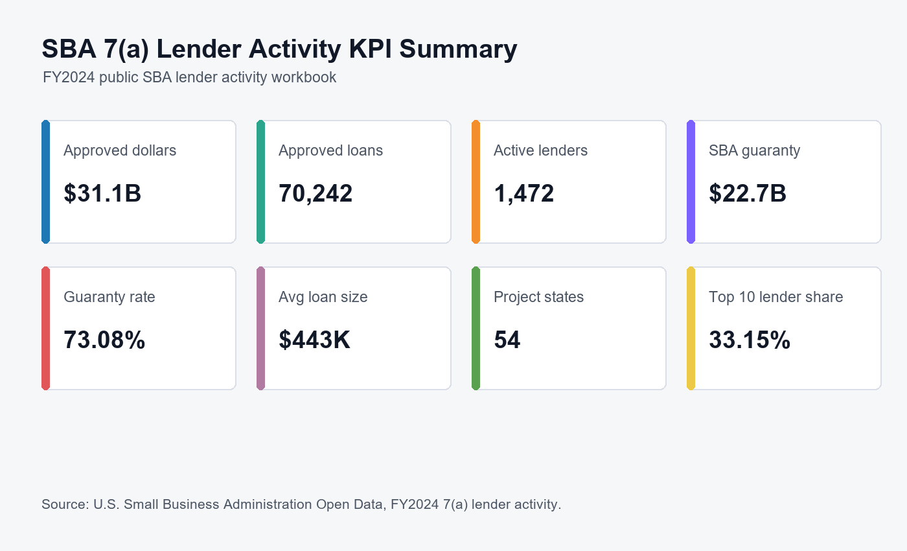
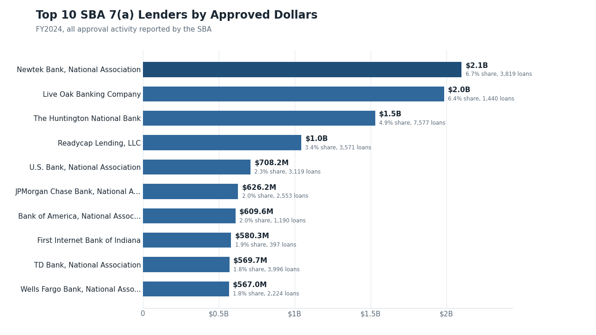
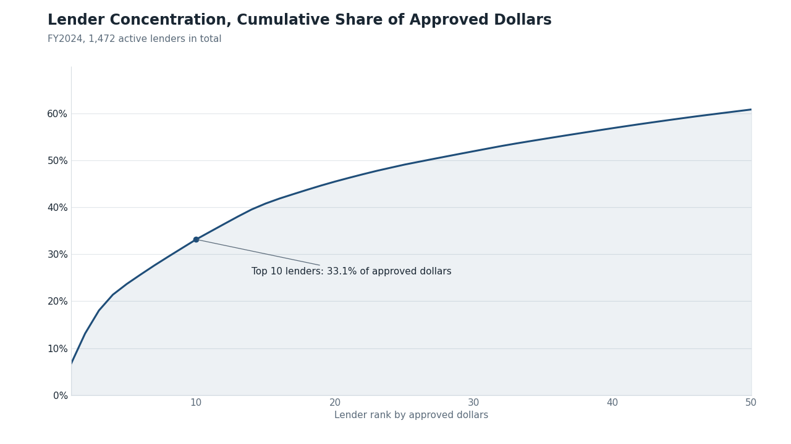
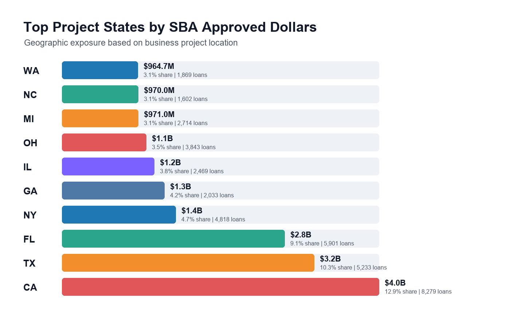
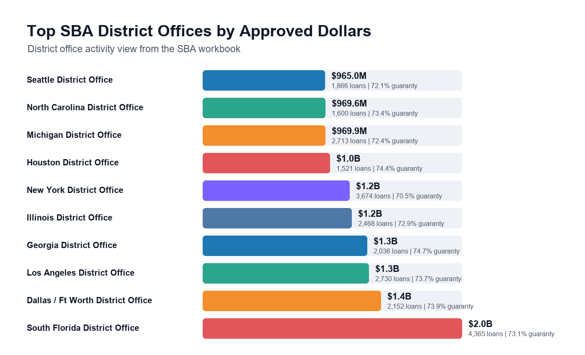

# SBA 7(a) Lending Activity - Data & BI Project

End-to-end BI workflow over public SBA lending data: Python ingest with
data-quality gates, a star-schema reporting layer, a dbt project that runs
the same models on DuckDB, a Power BI-ready semantic model with DAX
measures, and a Snowflake migration design.

## Business Problem

SBA 7(a) activity is published as a multi-sheet Excel workbook, aggregated
three different ways (lender, lender by project county, lender by district
office). That format is fine for downloading and skimming, but it can't
answer portfolio questions directly: who drives approved dollars, how
concentrated is the lender base, where is exposure clustered geographically,
and how much of it is federally guaranteed. This project turns the workbook
into a tested reporting layer that answers those questions and is honest
about data reliability while doing it.

## Data Source and Grain

- Source: [SBA 7(a) & 504 Activity Reports, FY2024 Year End](https://web.data.sba.gov/en/dataset/7-a-504-activity-reports-fy2024-year-end) (SBA Open Data)
- Raw file: `data/raw/lender7aactivity_fy2024_20240930.xlsx`
- Fact grain: lender x project county x reporting period

The source is aggregated lender activity. There is no borrower-level detail
(no defaults, delinquency, or credit scores), and the model keeps that grain
rather than implying detail the SBA doesn't publish.

## How Data Moves

1. `src/run_pipeline.py` reads the workbook sheets defined in
   `config/column_mappings.json`, cleans them, and rejects rows with missing
   required fields or invalid amounts (with reasons, to
   `data/quality/rejected_records.csv`).
2. Cleaned tables land in `data/processed/`, and the star schema
   (fact + dimensions) in `data/warehouse/`.
3. Data-quality checks run over both layers and write
   `data/quality/data_quality_report.csv`.
4. Named SQL queries in `sql/analysis_queries.sql` produce the KPI and
   concentration analysis, and matplotlib renders the charts in `visuals/`.
5. The dbt project in `dbt/` rebuilds the same star schema on DuckDB with
   schema tests - the warehouse-native version of step 2.
6. Power BI (`powerbi/sba_lending.pbip`) loads the warehouse CSVs into a
   model with relationships and DAX measures already defined. The report
   pages are named but still empty; layouts get built in Power BI Desktop.

Architecture and model diagrams: [docs/architecture.md](docs/architecture.md)

## KPI Definitions

| KPI | Definition |
| --- | --- |
| Total Approved Dollars | Sum of gross approved loan dollars |
| Total Loan Count | Sum of approved loan counts |
| Average Loan Size | Approved dollars / loan count |
| Guaranty Rate | SBA-guaranteed dollars / approved dollars |
| Lender Share | A lender's approved dollars / grand total |
| Top 10 Lender Share | Approved dollars of the 10 largest lenders / grand total |

## What the Data Shows (FY2024)

Approved activity totals $31.1B across 70,242 loans from 1,472 lenders, with
$22.7B (73.1%) carrying an SBA guaranty. Concentration is real but not
extreme: the top 10 lenders hold 33.2% of approved dollars, led by Newtek
Bank at $2.1B, and no single lender exceeds 7% of the market. California is
the largest project state at $4.0B (12.9% of the total), and Los Angeles
County alone accounts for $1.2B. Newtek also has the widest footprint,
lending across 51 states and territories.











## Data Quality

Cleaning rejects rows rather than silently dropping them, and every run
re-validates: missing required values, duplicates, non-negative amounts,
guaranty not exceeding approved dollars, unique dimension keys, non-null
fact foreign keys, valid state codes, and fact-to-dimension integrity.
The current source passes all checks with zero rejected records - the value
of the gates is that a future workbook that doesn't pass won't quietly
poison the dashboard.

The same rules exist twice deliberately: procedurally in
`src/sba_bi/quality.py` for the operational pipeline, and declaratively as
dbt tests for the warehouse path.

## Technology

- Python (pandas, matplotlib): ingest, validation, star schema, charts
- SQL: SQLite for local analysis queries; DuckDB under dbt
- dbt: staging / intermediate / marts layers with schema and singular tests
- Power BI: PBIP project with semantic model and DAX measures (report
  page layouts still to be built)
- Snowflake: schema DDL, `COPY INTO` loading, migration notes (design only)

## Setup

```bash
pip install -r requirements.txt

python src/run_pipeline.py            # full pipeline
python -m unittest discover -s tests  # unit + integration tests

pip install dbt-duckdb
dbt build --project-dir dbt --profiles-dir dbt   # from the repo root
```

Then open `powerbi/sba_lending.pbip` in Power BI Desktop (set the `DataRoot`
parameter to this repo's `data/` folder if prompted). Page layout guidance:
[powerbi/dashboard_pages.md](powerbi/dashboard_pages.md).

## Repository Structure

```text
config/          workbook sheet and column mappings
data/            raw workbook, processed CSVs, warehouse tables, quality outputs
dbt/             dbt project (DuckDB) with tests and seeds
docs/            architecture and model diagrams
powerbi/         sba_lending.pbip, model docs, DAX reference, page layout
snowflake/       schemas, DDL, COPY INTO examples
sql/             named analysis queries run by the pipeline
src/             pipeline package (sba_bi) and entry point
tests/           unit tests (synthetic data) and integration tests
visuals/         charts rendered by the pipeline
```

## Limitations

- Aggregated activity data, so no default rates, credit quality, or
  borrower-level analysis - this measures origination activity, not risk.
- One reporting period (FY2024 year end); trend views need more snapshots.
- The Snowflake layer is written and organized for Snowflake but hasn't been
  executed against a live account.
- District office totals come from a separate source aggregation and don't
  join to the county-grain fact table.
- The Power BI project is the semantic model, relationships, and measures;
  the report pages themselves are not laid out yet.

## Next Steps

- Load a second fiscal year to unlock trend analysis in `dim_date`.
- Point the dbt profile at Snowflake and materialize the marts there.
- CI that runs the unit tests and `dbt build` on every push.
- Build the report page layouts in Power BI Desktop and publish to the
  service.
