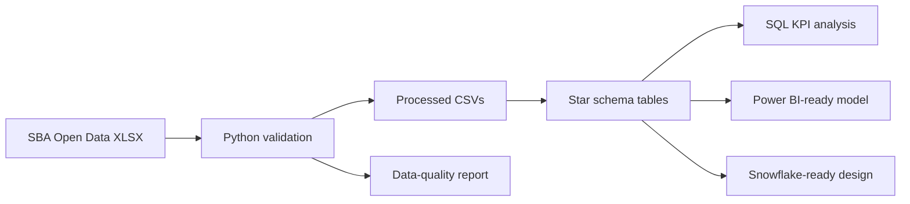

# SBA 7(a) Lender Activity Data & BI Project

End-to-end financial Data & BI workflow using Python, SQL, a warehouse-style star schema, automated data-quality checks, and Power BI-ready reporting assets.

## Business Problem

SBA 7(a) lending activity is spread across lenders, geographies, and district office views. This project turns the public SBA workbook into a clean reporting layer that helps answer: who drives approved dollars, where activity is concentrated, how much exposure is guaranteed by the SBA, and whether the reporting data is reliable enough for dashboarding.

## Data Source and Grain

- Source: U.S. Small Business Administration Open Data
- Dataset: SBA 7(a) & 504 Activity Reports, FY2024 Year End
- Raw file: `data/raw/lender7aactivity_fy2024_20240930.xlsx`
- Source URL: https://web.data.sba.gov/en/dataset/7-a-504-activity-reports-fy2024-year-end
- Fact grain: lender by project county by reporting period

The source is aggregated lender activity, not borrower-level repayment or default data. The project does not pretend to have individual borrower loans, credit scores, delinquency, or default flags.

## Interview Numbers

| Metric | Value |
| --- | ---: |
| Approved loans | 70,242 |
| Approved dollars | $31.12B |
| Top 10 lender share | 33.15% |

## Core Workflow

1. Clean raw SBA workbook.
2. Run SQL analysis.
3. Generate KPIs and visuals.
4. Export star-schema tables for Power BI.
5. Produce data-quality checks and rejected-record output.

## Technology Stack

- Python: workbook ingestion, schema validation, star-schema generation, data-quality checks, visuals.
- SQL: KPI, lender concentration, geography, and district office analysis.
- Power BI-ready layer: fact/dimension CSVs, relationships, DAX measures, dashboard blueprint.
- dbt-inspired SQL: staging, intermediate, and marts model folders.
- Snowflake-ready SQL: schemas, table DDL, and sample `COPY INTO` loading logic.

## Architecture



Detailed architecture and model diagram: [docs/architecture.md](docs/architecture.md)

## Star Schema Outputs

| Table | Output |
| --- | --- |
| FactLendingActivity | `data/warehouse/fact_lending_activity.csv` |
| DimLender | `data/warehouse/dim_lender.csv` |
| DimGeography | `data/warehouse/dim_geography.csv` |
| DimDate | `data/warehouse/dim_date.csv` |

## Data Quality

The pipeline validates missing required values, duplicate rows, non-negative amounts, SBA guaranty amounts not exceeding approved dollars, valid state codes, unique dimension keys, and fact-to-dimension relationships.

Outputs:

- `data/quality/data_quality_report.csv`
- `data/quality/rejected_records.csv`

Current result: all checks pass and rejected record count is 0.

## Power BI Assets

Power BI Desktop is not available in this environment, so no `.pbix` file is committed. The repo includes the data model, DAX measures, and dashboard page blueprint needed to build the report.

- [Power BI model notes](powerbi/README.md)
- [DAX measures](powerbi/dax_measures.md)
- [Dashboard page blueprint](powerbi/dashboard_pages.md)

Recommended report pages:

1. Executive Overview
2. Lender Analysis
3. Geographic Analysis
4. Data Quality

## Key Insights

- SBA 7(a) FY2024 activity totals $31.12B across 70,242 approved loans and 1,472 lenders.
- SBA guaranty exposure totals $22.75B, equal to 73.08% of approved dollars.
- The top 10 lenders account for 33.15% of approved dollars.
- Newtek Bank, National Association is the largest lender by approved dollars at $2.1B.
- California is the largest project state at $4.0B.
- Los Angeles County, CA is the largest county exposure at $1.2B.
- South Florida District Office is the largest SBA district office view at $2.0B.

## Visuals


## Repository Structure

```text
financial-portfolio-data-bi-project/
|-- config/
|   `-- column_mappings.json
|-- data/
|   |-- raw/
|   |-- processed/
|   |-- warehouse/
|   `-- quality/
|-- docs/
|   `-- architecture.md
|-- models/
|   |-- staging/
|   |-- intermediate/
|   `-- marts/
|-- notebooks/
|   `-- analysis.py
|-- powerbi/
|   |-- README.md
|   |-- dashboard_pages.md
|   `-- dax_measures.md
|-- snowflake/
|-- sql/
|-- tests/
|-- visuals/
|-- requirements.txt
`-- README.md
```

## How to Run

```bash
pip install -r requirements.txt
python notebooks/analysis.py
python -m unittest discover -s tests
```

Running the pipeline regenerates processed CSVs, warehouse tables, data-quality reports, SQL KPI outputs, and visuals.

## Limitations

- Data is aggregated SBA lender activity, not individual borrower-level credit performance.
- District office activity is a separate aggregation and is not joined into the county-grain fact table.
- Power BI assets are dashboard-ready specifications and model outputs, not a committed `.pbix`.
- Snowflake SQL is migration-ready design, not a verified live Snowflake deployment.

## Future Improvements

- Build the `.pbix` report in Power BI Desktop.
- Convert `models/` into an executable dbt project.
- Load `data/warehouse/` into Snowflake and run transformations there.
- Add CI to run unit tests and data-quality checks on every commit.
