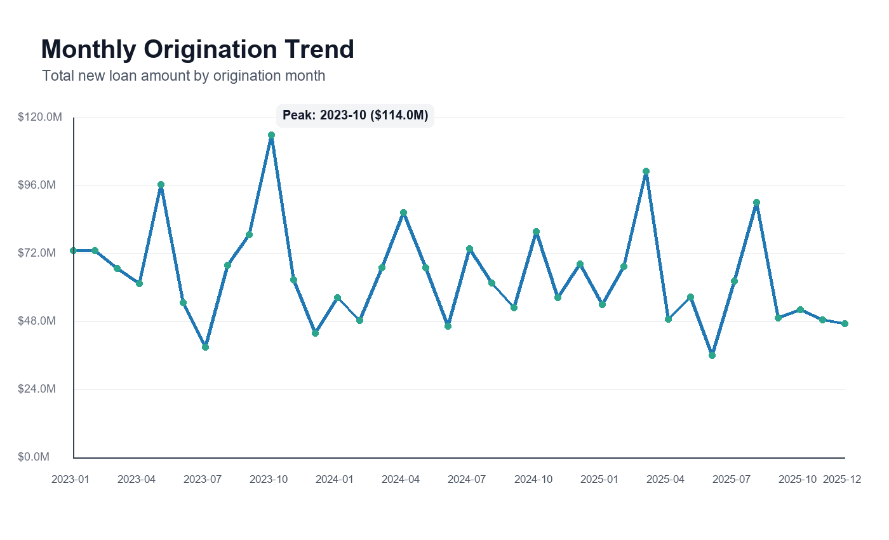
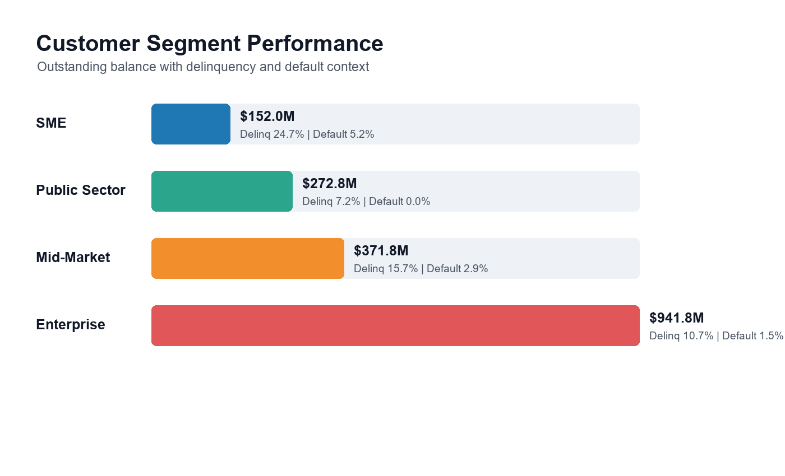
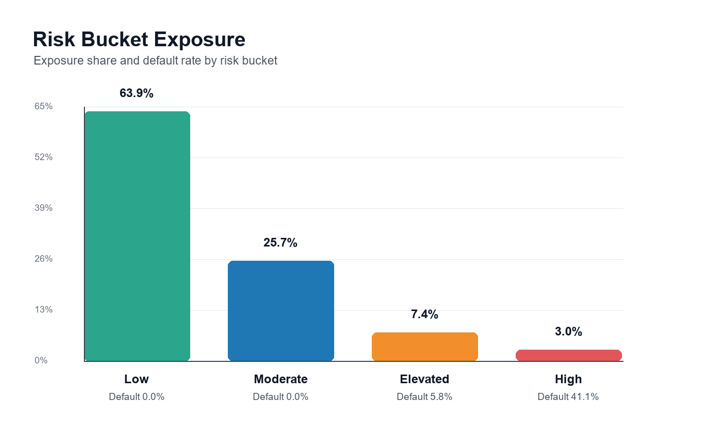

# Financial Portfolio Data & BI Project

A Python and SQL workflow over a synthetic loan portfolio. The script cleans the raw data, loads it into SQLite, runs KPI and segment/risk queries, and exports a handful of charts.

The dataset is synthetic. It mirrors a financial services loan book with customers, regions, industries, products, payment behavior, balances, risk buckets, and credit indicators.

## Tools Used

- Python
- pandas and numpy
- SQLite SQL
- Pillow for PNG chart generation

## Workflow

1. Generate a synthetic loan/customer portfolio dataset.
2. Clean duplicate loan records and missing values.
3. Load the cleaned data into SQLite.
4. Run SQL queries for KPIs, trends, segments, regions, and risk buckets.
5. Create 4 visuals from the analysis outputs.
6. Summarize business insights for a BI-style readout.

## Data Cleaning Summary

- Raw dataset: 1,518 rows and 23 columns.
- Removed 18 duplicate loan records.
- Filled missing values in industry, credit score, annual revenue, and collateral value fields.
- Final analysis dataset: 1,500 cleaned loan records with no missing values.

## Key Business Questions

- Which regions hold the largest portfolio exposure?
- What are the monthly origination trends?
- Which customer segments show stronger or weaker repayment behavior?
- Which industries create concentration risk?
- How much exposure sits in elevated or high-risk buckets?
- What are the overall delinquency and default rates?

## KPI Summary

| KPI | Value |
| --- | ---: |
| Cleaned loan records | 1,500 |
| Customers | 374 |
| Total outstanding balance | $1.74B |
| Average interest rate | 6.17% |
| 30+ day delinquency rate | 17.00% |
| Default rate | 3.13% |
| Weighted average LTV | 0.63 |
| Elevated/High risk exposure | 10.38% |

## Key Insights

- Total outstanding portfolio is $1.74B across 1,500 loans and 374 customers.
- Europe is the largest region by outstanding balance at $563.6M.
- North America has the strongest repayment profile, with a 1.78% default rate and 12.25% 30+ day delinquency rate.
- Enterprise is the largest customer segment by exposure, while SME shows the highest default pressure at 5.16%.
- Manufacturing is the top industry concentration at 19.67% of outstanding balance.
- Elevated and High risk buckets represent 10.38% of total portfolio exposure.
- Origination volume peaked in 2023-10 at $114.0M.

## Visuals








## Repository Structure

```text
financial-portfolio-data-bi-project/
|-- data/
|   `-- loan_customer_portfolio.csv
|-- sql/
|   `-- analysis_queries.sql
|-- notebooks/
|   `-- analysis.py
|-- visuals/
|   |-- kpi_summary.png
|   |-- monthly_trend.png
|   |-- segment_performance.png
|   `-- risk_bucket_summary.png
|-- requirements.txt
`-- README.md
```

## How to Run

```bash
pip install -r requirements.txt
python notebooks/analysis.py
```

Running the script regenerates the dataset, executes the SQL analysis, prints the KPI summary and insights, and refreshes the visuals.

## Notes

I put this together to keep my data and BI skills sharp: cleaning structured data, writing SQL for KPIs and portfolio trends, and turning the results into charts and a short readout.
