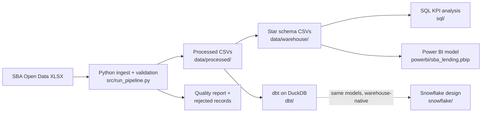
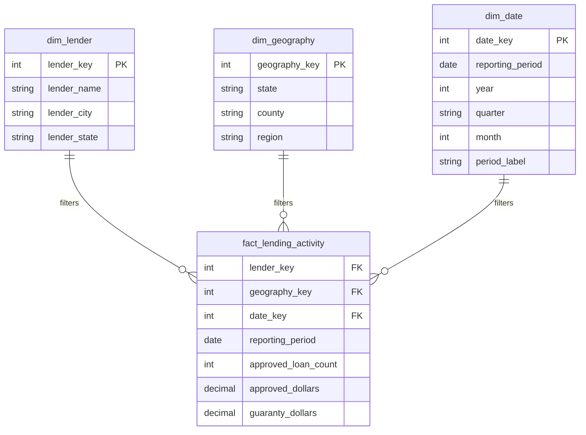

# Architecture

End-to-end BI workflow over the SBA 7(a) FY2024 lender activity workbook:
Python handles ingest and validation, the reporting layer is a star schema,
dbt rebuilds the same models on DuckDB, and a Power BI semantic model
sits on top (the report layouts are built in Power BI Desktop).

## Data Flow

The star schema is produced twice on purpose. `src/sba_bi/warehouse.py` builds
it procedurally in pandas and exports the CSVs Power BI reads today. The dbt
project rebuilds it declaratively on DuckDB with schema tests, which is the
shape the logic would take in a warehouse.

## Star Schema

## Fact Grain

One row per lender, per project county, per reporting period. That matches
the most detailed sheet in the source workbook. The SBA publishes this data
already aggregated, so there is no loan- or borrower-level detail anywhere in
the model, and the fact table does not invent any.

Two modeling decisions worth noting:

- District office activity is a separate aggregation in the source and does
  not join to county-grain rows, so it stays in its own staging table rather
  than being forced into `dim_geography`.
- `region` on `dim_geography` is derived from the project state using census
  regions (see `dbt/seeds/state_regions.csv`).

## Data Quality Controls

The pipeline writes a check-by-check report to
`data/quality/data_quality_report.csv` and rejected source rows with reasons
to `data/quality/rejected_records.csv`. Checks cover missing required values,
duplicate rows, non-negative amounts, guaranty dollars not exceeding approved
dollars, unique dimension keys, non-null fact foreign keys, valid state
codes, and fact-to-dimension integrity. The dbt project asserts the same
rules as schema and singular tests, and `tests/` covers the cleaning logic
itself with unit tests.

## Limitations

- Aggregated lender activity only: no default flags, delinquency, collateral,
  or credit scores, so no credit-risk conclusions should be drawn from it.
- A single reporting period (FY2024 year end), so no trend analysis yet.
- The Snowflake SQL is a migration design, not a deployed warehouse.

## Scale Path

1. Land the raw workbook in cloud storage and `COPY INTO` Snowflake RAW.
2. Repoint the dbt profile from DuckDB to Snowflake; the models carry over.
3. Schedule ingest + `dbt build` and publish Power BI against the marts.
4. Add CI to run the unit tests and dbt tests on every commit.
