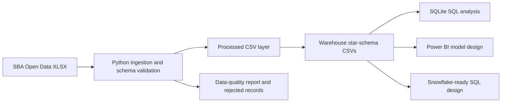
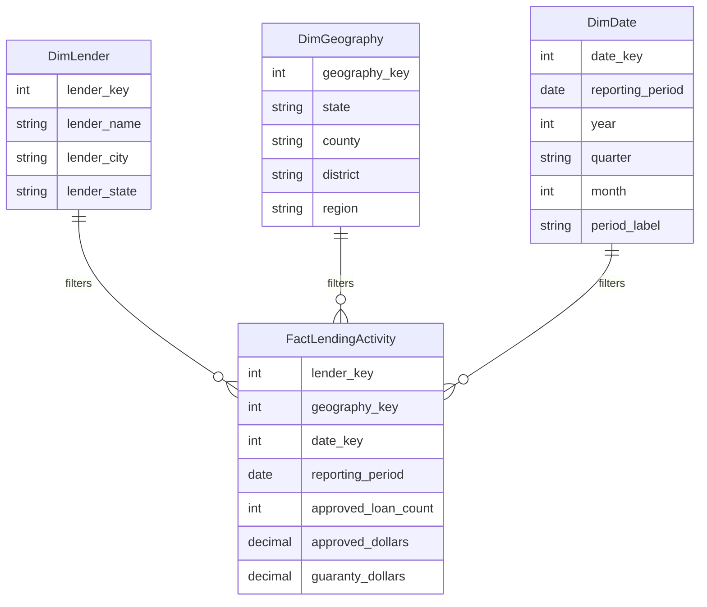

# Architecture

This project is an end-to-end BI workflow over official SBA 7(a) FY2024 lender activity data.

## Data Flow

## Star Schema

## Fact Grain

The fact table grain is lender by project county by reporting period. The source workbook is aggregated SBA lender activity, so the project does not create borrower-level or loan-level rows that are not present in the source data.

## Data Quality Controls

The Python pipeline checks:

- Missing required values.
- Duplicate source rows.
- Non-negative approved loan counts and dollar amounts.
- SBA guaranty dollars not exceeding approved dollars.
- Unique dimension keys.
- Non-null fact foreign keys.
- Valid U.S. state and territory codes.
- Fact-to-dimension relationship integrity.

Outputs:

- `data/quality/data_quality_report.csv`
- `data/quality/rejected_records.csv`

## Limitations

- The SBA workbook is aggregated lender activity, not borrower-level repayment behavior.
- There is no default flag, delinquency status, collateral value, or credit score in the source.
- District office data is a separate aggregation and does not join cleanly to county-level fact rows at the same grain.
- The Power BI dashboard is specified through a model blueprint and DAX measures; a `.pbix` file is not committed from this environment.
- Snowflake SQL is design-ready but not executed in a live Snowflake account in this repository.

## Scale Path

1. Replace local CSV exports with Snowflake stages and tables.
2. Convert `models/` into a real dbt project.
3. Schedule workbook ingestion and validation.
4. Publish the Power BI report against the Snowflake marts.
5. Add CI checks for schema, data-quality, and SQL style.
